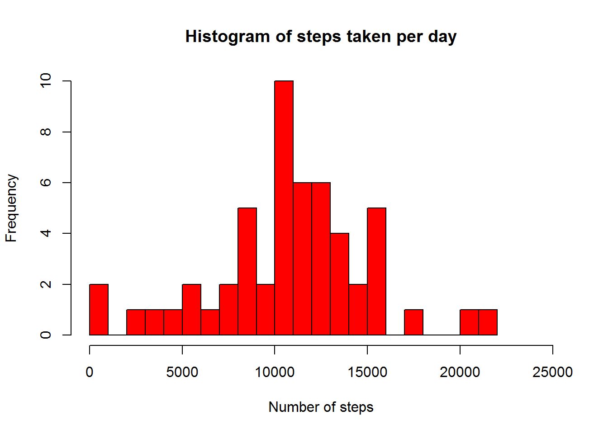
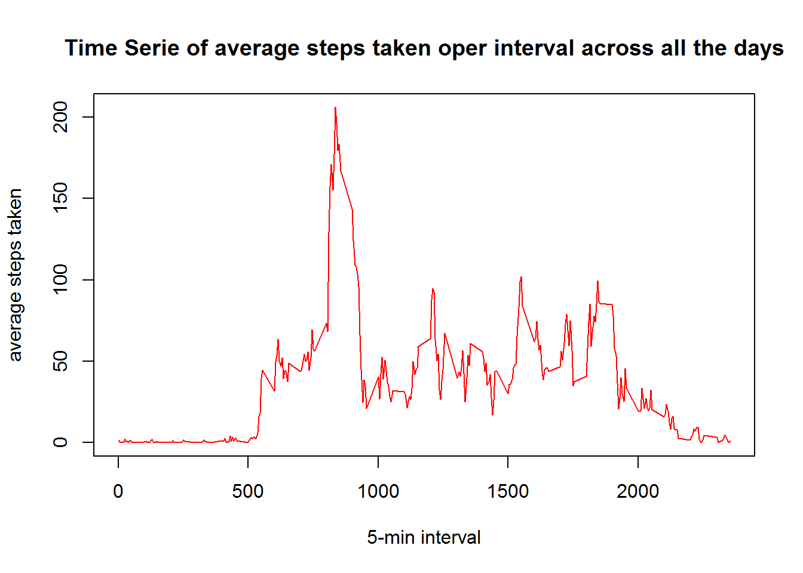
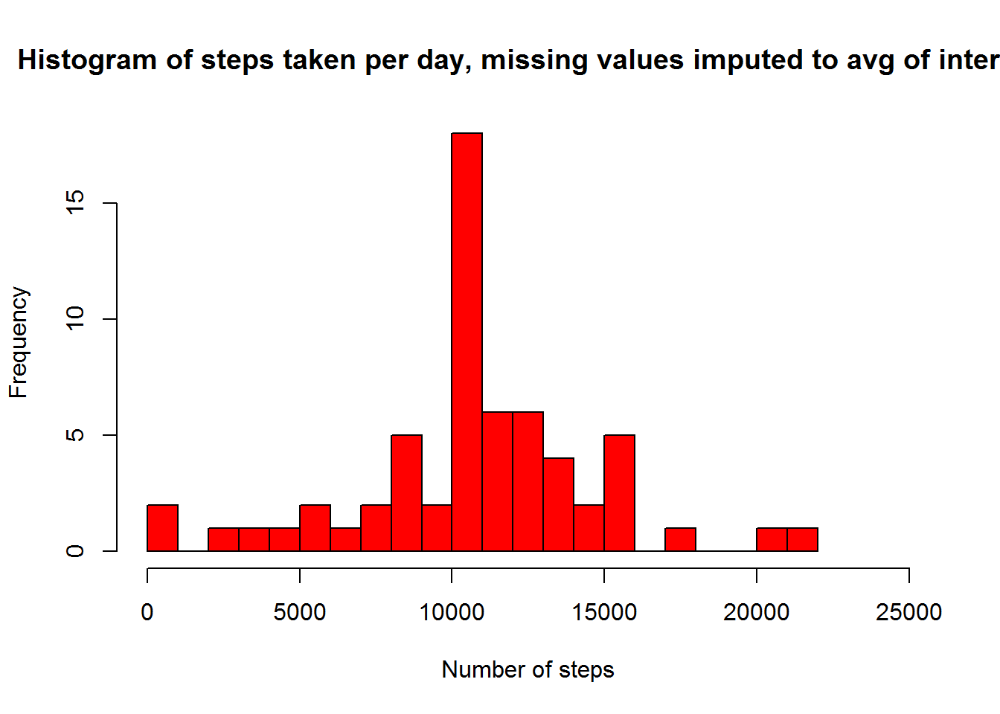
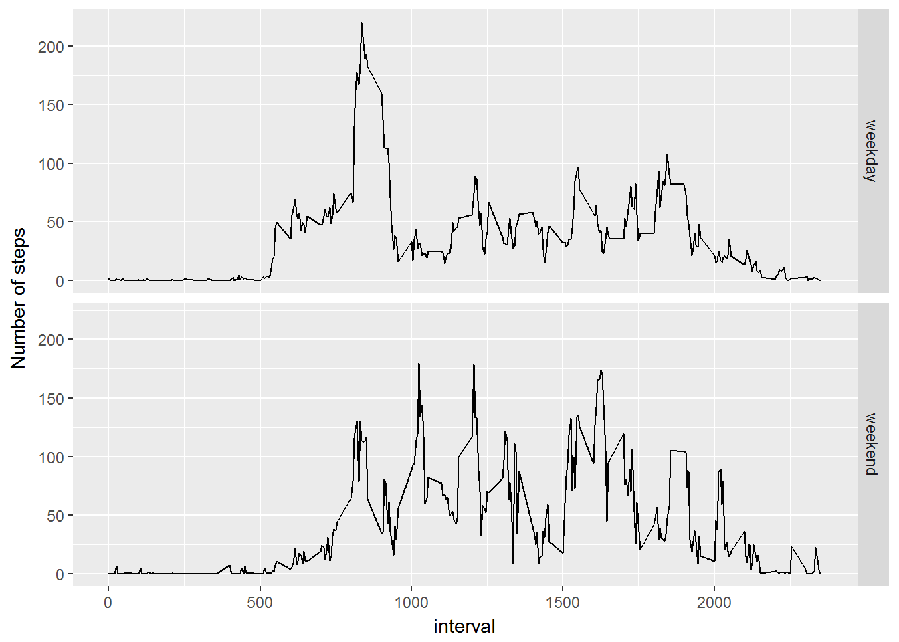

## Loading and preprocessing data

First of all, working directory and data are addresed:


```r
setwd("C:/Users/rhermosa/Desktop/DataScience/5_ReproducibleResearch/Week2/RepData_PeerAssessment1")
docs <- "activity.csv"
#There is only 1 file named activity.csv
if (!file.exists(docs)){
        docs <- unzip("activity.zip")        
}
#reading the file
activity <- read.csv(docs)
```
Processing steps to have analytical data:

```r
activity$date <- as.Date(activity$date, "%Y-%m-%d")
```

## Mean of total steps taken per day
Missing values will be ignored:


```r
steps_per_day <- aggregate(steps~date, data = activity, sum, na.action = na.omit)

hist(steps_per_day$steps, breaks=25, xlim =c(0,25000), col = "red", main = "Histogram of steps taken per day", xlab= "Number of steps")
```



```r
#obtaining mean and median
mean(steps_per_day$steps)
```

```
## [1] 10766.19
```

```r
median(steps_per_day$steps)
```

```
## [1] 10765
```

## Average of daily activity pattern


```r
steps_per_interval <- aggregate(steps~interval, data = activity, mean)

with(steps_per_interval, plot(interval, steps, type= "l", col = "red", xlab="5-min interval", ylab = "average steps taken", main = "Time Serie of average steps taken oper interval across all the days"))
```



```r
#Obtaining the max value
steps_per_interval[which.max(steps_per_interval$steps),]
```

```
##     interval    steps
## 104      835 206.1698
```

## Imputing missing values


```r
missing_steps <- is.na(activity$steps)
sum(missing_steps)
```

```
## [1] 2304
```

```r
# missing value are to be filled with 5min interval avg
# previously calculated
#defining function to replace data
replace <- function (interval, value){
        if (is.na(value)){
                val_to_fill <- steps_per_interval[steps_per_interval$interval == interval,"steps"]
        }
        else val_to_fill = value
        return (val_to_fill)
}
# creating a new dataset
filled_act <- activity
filled_act$steps <- mapply(replace, filled_act$interval, filled_act$steps)
```

```r
steps_filled <- aggregate(steps~date, data = filled_act, sum)
hist(steps_filled$steps, breaks=25, xlim =c(0,25000), col = "red", main = "Histogram of steps taken per day, missing values imputed to avg of interval", xlab= "Number of steps")
```



```r
#obtaining mean and median
mean(steps_filled$steps)
```

```
## [1] 10766.19
```

```r
median(steps_filled$steps)
```

```
## [1] 10766.19
```
Histogram is higher (more frequencies) in the middle, being consistent with the replacement of missing values by the mean of that interval across the days (note that in the first histrogran NAs values have been ignored, so not printed). The new filled values are printed in this case and, as expected, are mean values, not extreme values (in general).

The mean is exactly the same, it is again consistent, since the filling of values has been done with average values.

## Differences in activity patterns between weekdays and weekends
Using filled dataset


```r
classified_day <- function(date){
        day <- weekdays(date)
        # be carefull of acent in Spanish ...
        weekend_days = c("sábado", "domingo")
        if (day %in% weekend_days){
                classified_day = "weekend"
        }
        else classified_day = "weekday"
        return (classified_day)
}

filled_act$weekday <- sapply(filled_act$date, FUN = classified_day)

avgs <- aggregate(steps ~ interval + weekday, data = filled_act, mean)

library(ggplot2)
g<- ggplot(avgs, aes(interval, steps))
g<- g + geom_line() + facet_grid(weekday ~ .) + ylab("Number of steps")
print(g)
```




